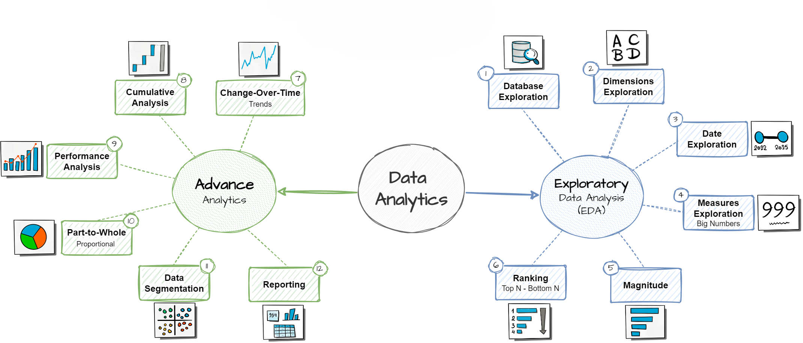

# EDA and Advanced Analytics Project using SQL
This project contains a comprehensive collection of SQL scripts for data exploration, analytics and reporting. These scripts cover various analyses such as database exploration, measures and metrics, time-based trends, cumulative analytics, segmentation, and more. Each script focuses on a specific analytical theme and demonstrates best practices for SQL queries.

---

## 🎯 Project Overview

This project demonstrates a range of SQL-based analytical techniques applied to structured datasets containing information about customers, products and their relation with sales. It focuses on extracting meaningful insights through exploratory data analysis (EDA) and advanced query logic.

### 🛢️ Database Overview

In this project, data has been taken from the gold layer of [SQL Data Warehouse Project](https://github.com/HASAN9519/SQL_Data_Warehouse_Project) which houses business-ready data modeled into a star schema required for reporting and analytics. After taking data from source as csv file, they are dumped into a separate database which consists three tables as following:

1. **gold.dim_customers:** 
    
    contains information like customer_id, customer_number, name, country, marital_status, gender, birthdate.
2. **gold.dim_products:**

    contains information like product_id, product_number, product_name, category, subcategory, maintenance, cost.           
3. **gold.fact_sales:** 

    contains information like order_number, order_date, shipping_date, due_date, sales_amount, quantity, price.          

**Using these tables following sections of tasks are carried out:**

### 🔍 Exploratory Data Analysis (EDA)

Exploration of raw datasets to uncover structure, trends, and anomalies before deeper modeling begins. This covers following facts:

    1. Database Exploration
        - Inspects tables and relationships.
        - Assesses data availability and completeness.

    2. Dimensions Exploration
        - Explores categorical variables (e.g., region, type).
        - Identifies distribution and variety.

    3. Date Exploration
        - Analyzes temporal features.
        - Enables seasonality and time series detection.

    4. Measures Exploration - Big Numbers
        - Surfaces high-impact metrics (totals, sums).
        - Ideal for dashboards and executive summaries.

    5. Magnitude
        - Compares scale across variables.
        - Useful for cost, volume, and output analysis.

    6. Ranking (Top-N / Bottom-N)
        - Highlights highest and lowest performers.
        - Enables prioritization and root cause analysis.

### 🌟 Advanced Analytics

Focused on summarizing, measuring, and interpreting trends to drive performance and decision-making. This section includes:

    1. Change-Over-Time Trends
        - Detects patterns across time periods.
        - For time-series analysis and identifying seasonality.

    2. Cumulative Analysis
        - Tracks progressive growth.
        - Useful for sales, user acquisition, and resource allocation.

    3. Performance Analysis
        - Measures KPIs.
        - Ideal for benchmarking products category.

    4. Part-to-Whole Proportional
        - compare performance or metrics across dimensions or time periods.
        - To evaluate differences between categories.
        - Useful for budget or resource distributions.

    5. Data Segmentation
        - To group data into meaningful categories for targeted insights.
        - For customer segmentation, product categorization, or regional analysis.

    6. Reporting
        - Combines metrics in summary dashboards.
        - Enables stakeholder visibility and strategic alignment.

    7. Converting Reports to CSV
        - Ideal for structured analysis and visualizations.
        - No proprietary software needed to open or edit.

## 🧠 Skills Demonstrated

Highlight core skills like:
- Window functions
- Dynamic pivoting
- Performance optimization
- Integration with BI tools (e.g. Tableau)

## 🛠️ Setup
- SQL environment (PostgreSQL, SQL Server)
- Any database creation/setup scripts
- Dependencies if it uses Python/Jupyter for scripting or visualization
- Folder Structure:
    - datasets/: data files
    - scripts/: SQL scripts organized by analysis type
    - reports/: contains customer and product report both in csv and xlsx format

## 🛠️ Important Links & Tools:

- **[Datasets](datasets/):** Access to the project dataset (csv files).
- **[PostgreSQL](https://www.postgresql.org/):** for hosting SQL database.
- **[pgAdmin](https://www.pgadmin.org/):** GUI for managing and interacting with databases.
- **[Git Repository](https://github.com/):** Repository to manage, version, and collaborate on code efficiently.
- **[DrawIO](https://www.drawio.com/):** Design data architecture, models, flows, and diagrams.

## 📄 Key Queries and Features
- Modular SQL scripts for each analytical technique
- Commented queries for clarity and learning
- Reusable logic for similar business scenarios
- Designed for integration with BI tools like Tableau

## 🚀 How to Use
1. 	Clone the repository
2. 	Load datasets into your SQL environment
3. 	Run script from **[scripts/]** folder to set up database
4. 	Modify queries to fit your own use cases

## 📈 Sample Use Cases
- Sales performance: regional breakdowns
- Operational metrics: cumulative throughput

## 📊 Output Samples
- Screenshots of customer report and product report from csv fi;;e are in the following:

    
    

## 📌 Future Enhancements
- Add visual dashboards using Tableau or Power BI
- Include Python scripts for automation and reporting
- Expand to include real-world datasets and case studies

## 🌟 About Me

Hi there! I'm **Hasan Uz Zaman**. I’m an Data Science professional and passionate about fields that are related to Data and AI.

Let's stay in touch! Feel free to connect with me on the following platforms:

